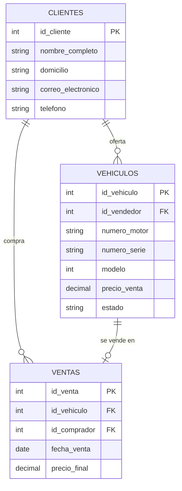
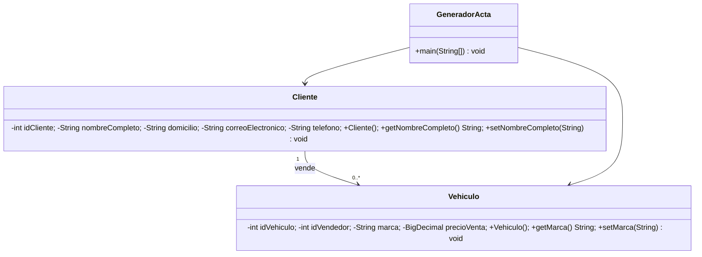

# Modelos del sistema

## Planteamiento del problema

Una agencia de autos usados necesita centralizar el registro de personas que ofertan o compran vehículos, publicar los autos disponibles y conservar la evidencia de cada venta. Sin un sistema, es difícil buscar ofertas, evitar vender dos veces el mismo vehículo y elaborar el acta de compraventa.

## Requerimientos funcionales

1. Registrar, consultar, editar y eliminar clientes.
2. Registrar, consultar, editar y eliminar vehículos vinculados a un vendedor.
3. Buscar vehículos por modelo, marca, precio y fecha de publicación.
4. Registrar una venta vinculando vehículo y comprador.
5. Cambiar el estado del vehículo a vendido al concluir una venta.
6. Listar ofertas activas de la más reciente a la más antigua.
7. Listar vehículos vendidos con fecha, comprador y vendedor.
8. Generar un acta imprimible de compraventa.

## Requerimientos no funcionales

- Interfaz responsiva y usable en móvil y computadora.
- Validaciones de campos obligatorios y de precios positivos.
- Persistencia en MySQL y consultas JavaScript parametrizadas.
- Código Java con POO básica y estructura legible.
- Scripts SQL reproducibles para migrar a otra máquina.

## Modelo entidad-relación

## Modelo relacional

- `CLIENTES(id_cliente PK, nombre_completo, domicilio, correo_electronico UQ, telefono, creado_en)`
- `VEHICULOS(id_vehiculo PK, id_vendedor FK -> CLIENTES, numero_motor UQ, numero_serie UQ, modelo, marca, linea, color, precio_compra, precio_venta, transmision, numero_cilindros, nacionalidad, descripcion, observaciones, fecha_publicacion, estado)`
- `VENTAS(id_venta PK, id_vehiculo FK -> VEHICULOS UQ, id_comprador FK -> CLIENTES, fecha_venta, precio_final)`

## Modelo de clases

