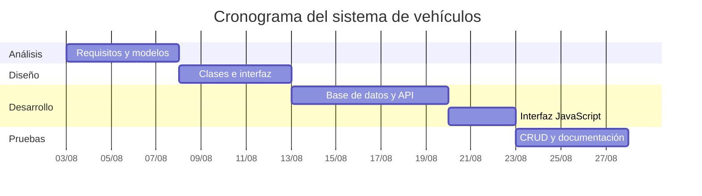

# Planeación del proyecto integrador

## Nombre y objetivo

**Sistema de compra-venta de vehículos usados.** Su objetivo es registrar clientes, vehículos, publicaciones y ventas para que una agencia consulte información confiable, evite ventas duplicadas y genere actas de compraventa.

## Diagrama tiempo-esfuerzo

| Etapa | Actividades | Esfuerzo estimado | Semana |
|---|---|---:|---:|
| Análisis | Requisitos, modelo ER y modelo relacional | 12 h | 1 |
| Diseño | Clases, interfaz y prototipo | 14 h | 2 |
| Desarrollo | SQL, API Java y frontend | 30 h | 3-4 |
| Pruebas y entrega | CRUD, capturas, documentación y presentación | 16 h | 5 |

## Diagrama de Gantt

## Costos, gastos y precio de venta

| Concepto | Tipo | Monto MXN |
|---|---|---:|
| Análisis y documentación | Costo de trabajo | $1,200.00 |
| Desarrollo Java, HTML, CSS y JavaScript | Costo de trabajo | $3,000.00 |
| Pruebas y presentación | Costo de trabajo | $800.00 |
| Internet y energía | Gasto | $300.00 |
| Material de presentación | Gasto | $200.00 |
| Riesgos estimados | Gasto contingente | $1,250.00 |
| **Costo total (CT)** |  | **$5,000.00** |
| **Gasto total (GT)** |  | **$1,750.00** |

Fórmula requerida: `PV = CT + GT + utilidad (25%) + impuestos (16%)`.

- Subtotal: $5,000.00 + $1,750.00 = $6,750.00
- Utilidad (25%): $1,687.50
- Impuestos (16% sobre subtotal + utilidad): $1,350.00
- **Precio de venta: $9,787.50 MXN**

## Riesgos y plan de acción

| Etapa | Riesgo | Costo integrado | Plan de acción |
|---|---|---:|---|
| Análisis | Requisitos incompletos | $150 | Revisar el documento y validar una lista de cumplimiento antes de programar. |
| Análisis | Cambios tardíos en los datos | $150 | Mantener el modelo relacional y scripts SQL versionados. |
| Diseño | Interfaz difícil de usar | $150 | Probar formularios con un compañero y ajustar etiquetas/validaciones. |
| Diseño | Diseño no responsivo | $150 | Validar en 375, 768, 1024 y 1440 píxeles. |
| Desarrollo | Error de conexión MySQL | $200 | Usar `database.properties.example` y comprobar conexión antes de la demostración. |
| Desarrollo | Consultas SQL incorrectas | $150 | Ejecutar CRUD con datos de prueba y usar `PreparedStatement`. |
| Pruebas | Venta duplicada | $150 | Restringir una venta por vehículo y validar estado `PUBLICADO`. |
| Pruebas | Pérdida de información | $150 | Conservar migraciones, datos de prueba y copia de la base antes de presentar. |

Total de riesgos integrado en gastos: **$1,250.00 MXN**.

## Evidencias pendientes durante la demostración

1. Captura de alta, edición y eliminación de cliente.
2. Captura de alta, búsqueda y edición de vehículo.
3. Captura de registro de venta y acta imprimible.
4. Captura de ofertas activas y listado de vehículos vendidos.
