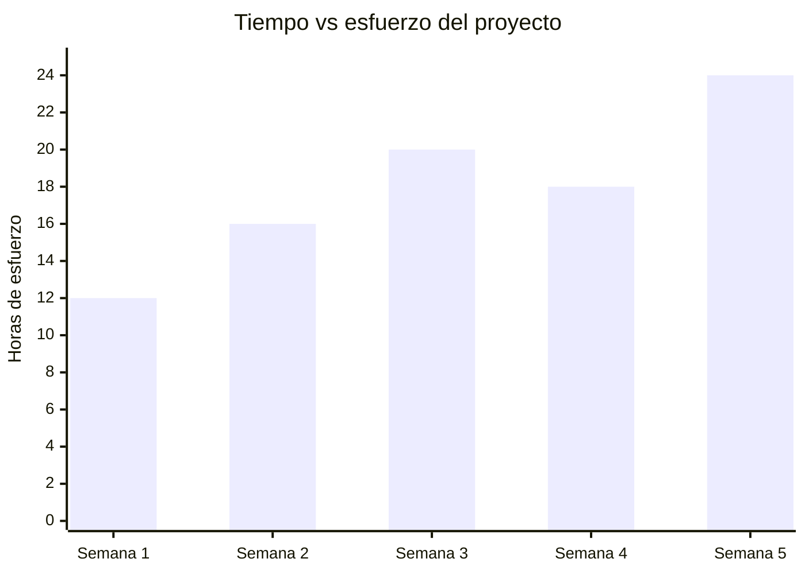
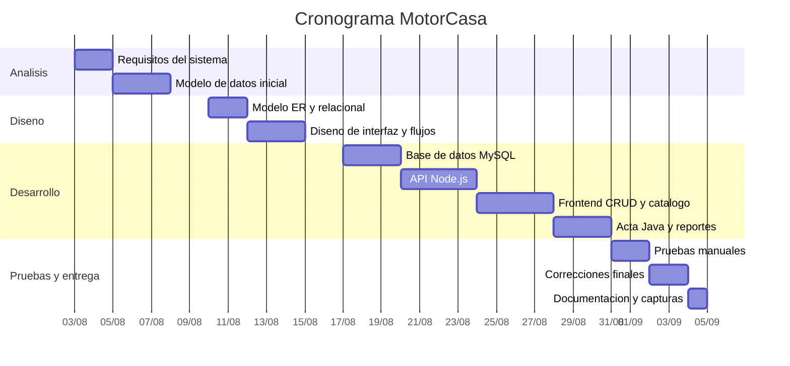

# Proyecto integrador

## 1. Nombre y objetivo del proyecto

**Nombre:** MotorCasa - Sistema de compra-venta de vehiculos usados.

**Objetivo general:** desarrollar un sistema web para una agencia de autos usados que permita registrar clientes, publicar vehiculos, consultar ofertas activas, registrar ventas, generar actas de compraventa y obtener reportes administrativos.

**Objetivos especificos:**

- Registrar clientes que pueden ofertar o comprar vehiculos.
- Registrar vehiculos vinculados a un vendedor.
- Buscar vehiculos por modelo, marca, precio y fecha de publicacion.
- Registrar ventas evitando que un vehiculo se venda mas de una vez.
- Generar actas de compraventa con datos del vehiculo, vendedor y comprador.
- Generar reportes de ofertas activas y vehiculos vendidos.

## 2. Diagrama tiempo-esfuerzo

Eje X: tiempo estimado en semanas.  
Eje Y: esfuerzo estimado en horas.

| Etapa | Actividades principales | Semana | Esfuerzo |
|---|---|---:|---:|
| Analisis | Levantamiento de requisitos, revision del problema, entidades, reglas de negocio | 1 | 12 h |
| Diseno | Modelo entidad-relacion, modelo relacional, clases Java, flujo de pantallas | 2 | 16 h |
| Desarrollo | Base de datos, API Node.js, frontend, CRUD, ventas y actas | 3-4 | 38 h |
| Pruebas | Pruebas CRUD, busquedas, reportes, actas y correccion de errores | 5 | 14 h |
| Entrega | Documentacion, evidencias, capturas, guia de instalacion y release | 5 | 10 h |



## 3. Diagrama de Gantt

Duracion total estimada: **5 semanas**.



## 4. Determinacion de costos y gastos

| Concepto | Clasificacion | Calculo | Monto |
|---|---|---:|---:|
| Analisis y documentacion | Costo de trabajo | 12 h x $100 | $1,200.00 |
| Diseno de base e interfaz | Costo de trabajo | 16 h x $100 | $1,600.00 |
| Desarrollo backend/frontend | Costo de trabajo | 38 h x $100 | $3,800.00 |
| Pruebas y correcciones | Costo de trabajo | 14 h x $100 | $1,400.00 |
| Documentacion y entrega | Costo de trabajo | 10 h x $100 | $1,000.00 |
| Internet y energia | Gasto operativo | Estimado | $450.00 |
| Equipo y depreciacion | Gasto operativo | Estimado | $600.00 |
| Material de entrega | Gasto operativo | Estimado | $300.00 |
| Contingencia por riesgos | Gasto de riesgo | Ver tabla de riesgos | $2,050.00 |
| **Costo total (CT)** |  |  | **$9,000.00** |
| **Gasto total (GT)** |  |  | **$3,400.00** |

## 5. Calculo del precio de venta

Formula solicitada:

```text
PV = CT + GT + utilidad (25%) + impuestos (16%)
```

Calculo:

| Concepto | Monto |
|---|---:|
| Costo total (CT) | $9,000.00 |
| Gasto total (GT) | $3,400.00 |
| Subtotal CT + GT | $12,400.00 |
| Utilidad 25% | $3,100.00 |
| Base antes de impuestos | $15,500.00 |
| Impuestos 16% | $2,480.00 |
| **Precio de venta (PV)** | **$17,980.00 MXN** |

## 6. Riesgos del proyecto

Se consideran 8 riesgos, 2 por cada etapa principal. El valor de cada riesgo se integra en el gasto total del proyecto como contingencia.

| Etapa | Riesgo | Impacto | Valor integrado |
|---|---|---|---:|
| Analisis | Requisitos incompletos o mal interpretados | Rehacer pantallas o campos | $250.00 |
| Analisis | Cambios tardios en reglas de venta | Ajustar base de datos y API | $250.00 |
| Diseno | Modelo relacional incorrecto | Fallas en consultas y reportes | $300.00 |
| Diseno | Interfaz confusa para el usuario | Mayor tiempo de correccion | $200.00 |
| Desarrollo | Error de conexion con MySQL | Sistema no inicia en demostracion | $300.00 |
| Desarrollo | Fallos en registro de venta o acta | Perdida de evidencia de venta | $350.00 |
| Pruebas | Datos duplicados o inconsistentes | Errores en CRUD y reportes | $200.00 |
| Entrega | Problemas al ejecutar en otra computadora | Retraso en presentacion | $200.00 |
| **Total integrado al precio** |  |  | **$2,050.00** |

## 7. Plan de accion para cada riesgo

| Riesgo | Plan de accion |
|---|---|
| Requisitos incompletos o mal interpretados | Comparar el sistema contra el documento de requerimientos y mantener checklist de funciones obligatorias. |
| Cambios tardios en reglas de venta | Usar migraciones SQL versionadas y separar frontend, backend y Java para modificar por partes. |
| Modelo relacional incorrecto | Revisar llaves primarias, foraneas y restricciones antes de capturar datos reales. |
| Interfaz confusa para el usuario | Separar el sistema por pestanas: tablero, clientes, vehiculos, ventas y reportes. |
| Error de conexion con MySQL | Crear `database.local.js`, documentar credenciales y probar conexion antes de la entrega. |
| Fallos en registro de venta o acta | Registrar primero la venta en MySQL y generar el acta despues; permitir regenerar acta desde reportes. |
| Datos duplicados o inconsistentes | Usar campos unicos para correo, numero de motor y numero de serie; validar comprador diferente del vendedor. |
| Problemas al ejecutar en otra computadora | Documentar instalacion manual sin `.bat` en `docs/entrega-release.md`. |

## Capturas de pantalla del sistema

Guarde las capturas reales en la carpeta `docs/capturas/` con los nombres indicados.

| Captura | Archivo sugerido | Que debe mostrar |
|---|---|---|
| Tablero principal | `docs/capturas/01-tablero.png` | Metricas, catalogo y filtros principales. |
| Clientes | `docs/capturas/02-clientes.png` | Formulario, busqueda y lista de clientes. |
| Vehiculos | `docs/capturas/03-vehiculos.png` | Registro de vehiculo e inventario. |
| Detalle de vehiculo | `docs/capturas/04-detalle-vehiculo.png` | Modal con todos los datos del vehiculo. |
| Venta | `docs/capturas/05-venta.png` | Registro de venta con comprador, precio, estatus y lugar. |
| Acta | `docs/capturas/06-acta.png` | Acta formal generada por Java. |
| Reportes | `docs/capturas/07-reportes.png` | Ofertas activas y vehiculos vendidos con fecha. |

### Evidencias


